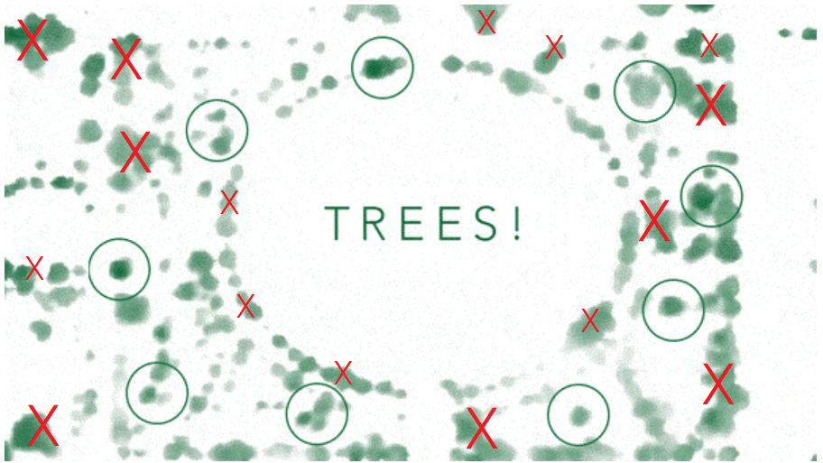

<a class="uk-button uk-button-default" href="https://canvas.asu.edu/courses/26991/assignments/588320">Submit Lab 03</a>


## Overview

In the previous lab we examined the practice of feature selection - identifying the proper set of variables to use as inputs into a predictive model. Gottman developed a framework using 20 micro-expressions coded at one-second intervals. Iceland developed a set of variables that help predict whether teens are likely to abuse alcohol. A key pattern that emerges from the case studies is that identifying the proper data to include in a model is difficult. Typically experts will start with a large number of measures and eliminate variables as they are tested. It requires patience and attention to detail to identify the right set of variables for a given problem. 

This week we will explore the process of "feature engineering", the task of starting from raw data sources like images and "engineering" new variables by finding ways to code or extract new features from the raw observations. Unlike the second lab where researchers developed new instruments to measure specific latent constructs or hard-to-observe outcomes, feature engineering is common when using administrative dataset like satellite imagery. Machine learning models typically require traditional quantitative variables to make predictions, so half of the work in building a model typically entails figuring out how to engineer new variables from a raw data source. 

For example, how can a computer read handwriting? It has to be able to translate easily from a the input image of the handwriting to some sort of mathematical abstraction of the text. 


## Optical Character Recognition

The process by which computer programs read handwriting or scan images of text is quite interesting because of how raw image files are converted into structured data. The process is broadly called [Optical Character Recognition](https://blog.filestack.com/thoughts-and-knowledge/history-of-ocr/). 


**Raw image of a graph**:


**Step 1**: Convert the colored picture to a grayscale version that emphasizes boundaries of graphics. 


**Step 2**: Filter out any data that is below a threshold for opacity or darkness. 


**Step 3**: Convert to a nagative view to maximize the contrast of the image. 


<iframe width="400" height="315" src="https://www.youtube-nocookie.com/embed/bmTp-6lDQEA" frameborder="0" allow="accelerometer; autoplay; encrypted-media; gyroscope; picture-in-picture" allowfullscreen></iframe>


[pdf](https://www.sciencedirect.com/science/article/pii/S2212671613000462)


## Trees

How many trees are in your city? It might seem like a straightforward question, but finding the answer can be a monumental task. New York City’s 2015-2016 tree census, for example, took nearly two years (12,000 hours total) and more than 2,200 volunteers.

https://www.citylab.com/environment/2018/12/urban-tree-canopy-maps-artificial-intelligence-descartes-labs/578701/

My research team has calculated just how much a tree matters for many urban areas, particularly megacities. Trees clean the air and water, reduce stormwater floods, improve building energy use, and mitigate climate change, among other things. For every dollar invested in planting, cities see an average $2.25 return on their investment each year.

https://www.citylab.com/environment/2018/04/heres-how-much-money-trees-save-in-megacities/559211/

Using high-resolution images that can capture a wide range of 


The interesting question is how the program know to NOT count these green patches as trees?




https://medium.com/descarteslabs-team/descartes-labs-urban-trees-tree-canopy-mapping-3b6c85c5c9cc


https://cran.r-project.org/web/packages/ForestTools/vignettes/treetopAnalysis.html


## Faces


Similar to the hand-writing recognition example, we can apply filters to an image to accentuate specific features. With letters on paper we are trying to maximize the contrast between the ink and the page. With faces, different filters applied to images (or image processing algorithms) will highlight specific facial features. 


The program will start with an image, and look for faces, frame the face, then look for prominent features so they can be isolated:


Once oriented to the face, an algorithm can identify facial landmarks that all people share: 


We can then move from the landmark view to an abstract model of the face:


Voila. We now have a mathematical model that can be used to generate a quantitative dataset from the face. You don't always know the distance from the camera to the face, so you might not be able to predict the actual size of specific features (is the face actually large or was the camera just way too close?), but it is easy enough to calculate relative sizes. If you set the distance between the eyes to a one, for example, then every other distance on this graph (each line) can be calculated relative to that distance. Each line on this image then represents a separate "feature", or data point in the database. 


There are [many different ways](https://towardsdatascience.com/face-detection-for-beginners-e58e8f21aad9) to accomplish this basic process of creating abstract models of the face.

And finally, we compare the measurements in the abstract model against measurements in a large database of candidate faces. You can do this quickly because you are working with a few dozen measures (distance between eyes, distance between edges of the mouth, distance between edge of mouth to eye, etc.). You would calculate the difference between the face you are trying to identify, and each face in the database by comparing the length of each line. If the total distance between all of the features falls below a threshold, then the faces are flagged as a match to be examined further by a human, or some action is triggered (unlocking your phone or your front door). 


Assuming that the photos are taken in good light with forward-facing subjects and decent resolution cameras, what do you anticipate being a challenge with this process? Are facial features static data points that never change? Or would our facial grid vary widely based upon expressions and angles?


Note that some features, like distance between the eyes and size of the nose, will be static. Others, like the edges of the mouth or the size of lips, will be highly dependent upon the expression. The models that match faces can weight certain features more than others to account for expressions in this way. 

Stated another way, some features convey more information that others. [This paper](https://www.sciencedirect.com/science/article/pii/S0010027718302397) explores which facial features, when changed, render the individual most unrecognizable and result in the biggest drop in correct matches to the database. This graphic from the paper gives you an intuitive sense of what the computer algorithm might experience as features are "corrupted" in the images. 


So if you are trying to escape the country by crossing a border, which feature would you try to disguise? 


## Buildings


https://www.nytimes.com/interactive/2018/10/12/us/map-of-every-building-in-the-united-states.html


## Guess the Profession from the Image


# Lab Questions:

## Part 1: Letters

Assume you have designed a program that can effectively isolate individual characters from an image of a license plate:


You now want to develop a machine learning model that will accurately identify each character, so you need to develop a set of features that describe the letters so the computer can begin to tell them apart. 

List three features that could be reliably derived ("engineered") from an image of a single letter, and used as input data for a preditive model that can read the license plate accurately when the font used by states might vary.


If you think this sounds challenging, recognize that there are hundreds of potential features. Just look at how many terms hipsters have invented to lovingly diagram their favorite typefaces:


Or spend five minutes with a [hand-writing analyst](https://www.wikihow.com/Tell-What-Someone-is-Like-from-Their-Handwriting).

You might start by pondering how someone would distinguish the difference between a lowercase "o" and a lowercase "a". 

How would you describe the difference between these letters to a child? 

How would you describe the difference between a "1" and an "l"?

Between a zero "0" and an upper-case "O"?

Capital "T" versus lower-case "t"?


## Part 2: Professions

The blog **Toward Data Science** describes an interesting machine learning application that [predicts which category an object or person belongs to based upon an image](https://towardsdatascience.com/train-image-recognition-ai-with-5-lines-of-code-8ed0bdd8d9ba). They demonstrate the software by training it to guess a person's career based upon a picture of them at work:

> *For this tutorial, we have provided a dataset called IdenProf. IdenProf (Identifiable Professionals) is a dataset that contains 11,000 pictures of 10 different professionals that humans can see and recognize their jobs by their mode of dressing.*


There are ten professions used in the example:

* Chef  
* Doctor 
* Engineer 
* Farmer 
* Firefighter 
* Judge 
* Mechanic 
* Pilot 
* Police 
* Waiter 

> *This dataset is split into 9000 (900 pictures for each profession) pictures to train the artificial intelligence model and 2000 (200 pictures for each profession) pictures to test the performance of the artificial intelligence model as it is training. IdenProf has been properly arranged and made ready for training your artificial intelligence model to recognize professionals by their mode of dressing. For reference purposes, if you are using your own image dataset, you must collect at least 500 pictures for each object or scene you want your artificial intelligence model to recognize.*

Suggest three features of uniforms that might be used to classify images from these professions. In this case, also include a rule statement about how you predict the feature to be used.

For example, if the uniform has stripes on the arms, the individual will be a figherfighter or a pilot. 

If the uniform includes a skirt the individual is not a farmer, mechanic, or chef (on the job). 

If the uniform is mostly black, the individual will be a judge, pilot, or police officer.

If the uniform is mostly white, the individual will be a chef or a doctor. 

If the uniform includes a bow tie, the individual will likely be a waiter (or an engineer?). 


---- 

<br>
<br>


<style>
img {
  width: 50%;
  border: 1px solid #ddd;
  border-radius: 4px;
  padding: 5px;
}
</style>

```
img {
  display: block;
  margin-left: auto;
  margin-right: auto;
  width: 50%;
  border: 1px solid #ddd;
  border-radius: 4px;
  padding: 5px;
}
```
